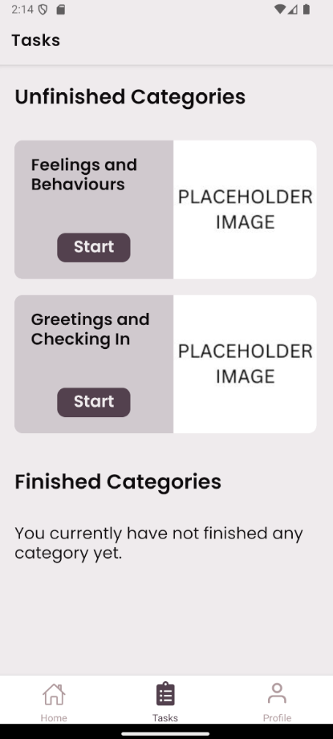
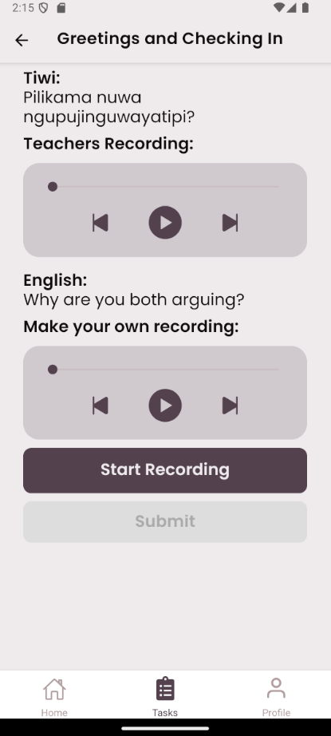
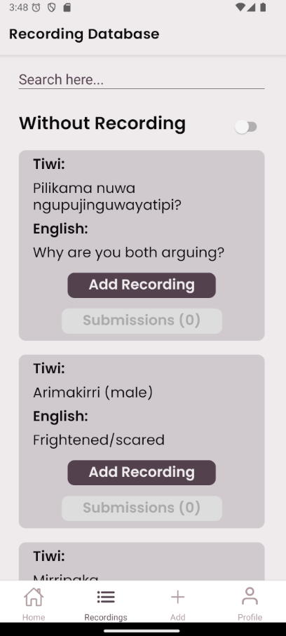
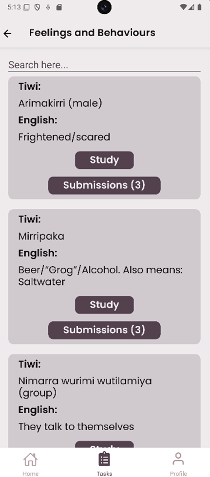

# HIT238

EchoLingo is a mobile application that aims to teach and improve students' Tiwi
language skills. The app provides an easy-to-use interface to display a list of
sentences provided by the teacher. The app also provides an interface for teachers
to update the database to be available for everyone.

## Get started

1. Install dependencies

    ```bash
    npm install
    ```

2. Start the app

    ```bash
    npx expo start
    ```

> [!NOTE]
> Some features are not available when using Expo Go directly on mobile phones.
> Use the Android Emulator by pressing 'a' after running npx expo start

> [!WARNING]
> All write access is disabled in firestore

## Screenshots





